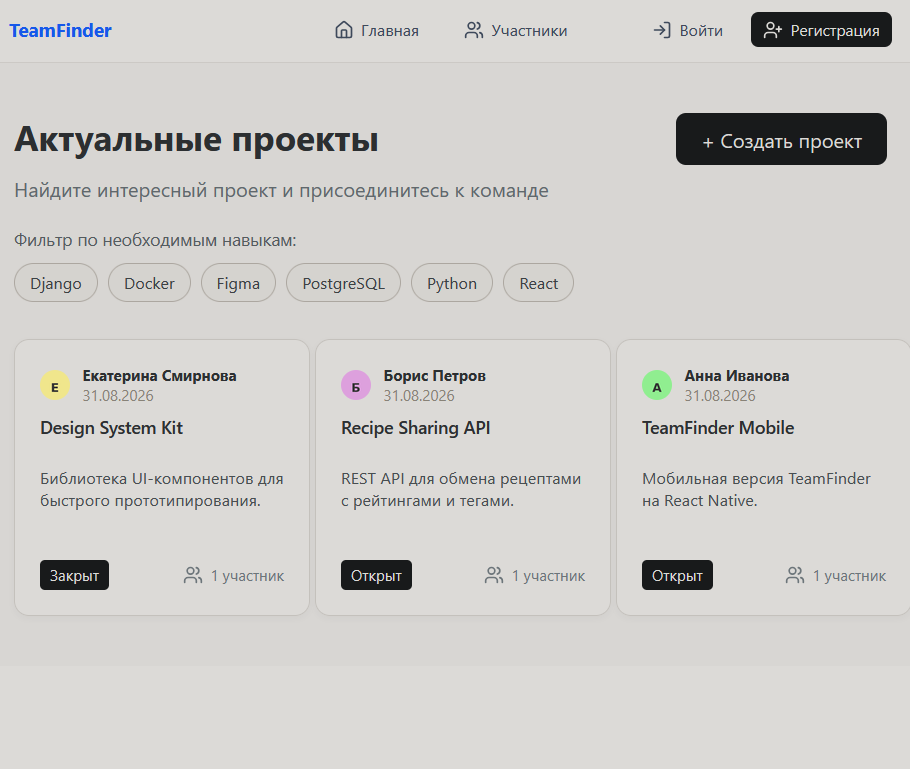

Курсовой проект по дисциплине «Разработка интернет-приложений на Python».

Тема: «Проектирование и реализация модуля необходимых навыков проектов с функцией автодополнения и фильтрации в веб-приложении TeamFinder».

## О проекте

**TeamFinder** — веб-приложение для поиска команды под pet-проекты. Пользователь публикует проект, указывает нужные навыки (например, Python, React, Figma) и статус (открыт/закрыт для участия). Другие пользователи находят проекты через фильтр по навыкам с автодополнением и присоединяются к понравившимся.

Реализовано полностью самостоятельно: модели и бизнес-логика на Django, кастомная модель пользователя с автогенерацией аватара, модуль навыков проекта (связь через `ManyToMany`, автодополнение и фильтрация по AJAX), деплой в продакшен на PostgreSQL.

## 🔗 Живая версия

**[https://teamfinder-embc.onrender.com](https://teamfinder-embc.onrender.com)**

Тестовые пользователи: `anna@example.com` / `boris@example.com` / `kate@example.com`, пароль у всех — `demo-password-123`.

> Сайт на бесплатном тарифе Render — если он не открывался больше 15 минут, первая загрузка может занять до минуты (сервер "просыпается").

## Функциональность

- Регистрация и вход по email, кастомная модель пользователя
- Автогенерация аватара с первой буквой имени, если пользователь не загрузил свой
- Создание, редактирование и просмотр проектов
- Присоединение к проекту и завершение проекта его автором
- Модуль навыков: добавление/удаление навыков проекта с автодополнением по уже существующим в базе
- Фильтрация списка проектов по навыку с подсветкой активного фильтра
- Список участников платформы

## Технологии

- **Backend**: Django 4.2, PostgreSQL
- **Frontend**: Django-шаблоны, ванильный JS (AJAX для автодополнения и действий с проектом)
- **Инфраструктура**: Docker Compose (БД для локальной разработки), деплой на Render (gunicorn, whitenoise, PostgreSQL)

Проект находится в папке [`team-finder-ad-main-3`](./team-finder-ad-main-3) — там же инструкция по локальному запуску и деплою.
